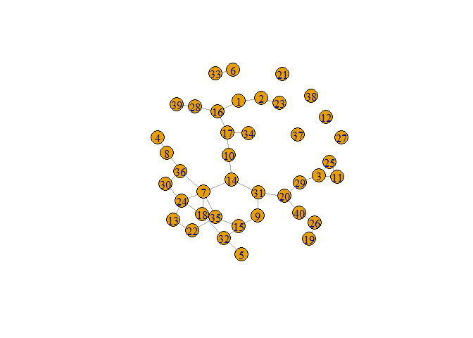
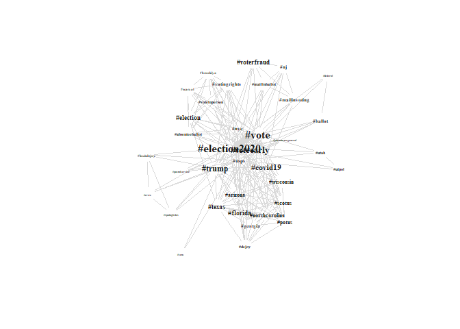

Lab 1: Data Formats for Networks
================
Tiernan Cahill
09/06/2021

# Loading Data and Required Packages

Let’s begin by importing the raw data from Brandwatch (stored in an
Excel file), as well as loading all of the packages we will need for
this lab:

-   `readxl` for reading Excel data into an R data frame
-   `dplyr` for wrangling data
-   `stringr` for parsing some messy text in the original dataset
-   `tidyr` for restructuring data
-   `igraph` for modelling and visualizing our network
-   `Matrix` for handling sparse matrices

``` r
library(readxl)
library(dplyr)
library(stringr)
library(tidyr)
library(igraph)
library(Matrix)

lab <- read_excel("../data/lab.xlsx") %>% 
  rename_all(~str_replace_all(., "\\s+", "")) # Remove whitespace from variable names
```

Looking at the raw data, we can see that there are `80` variable
included from Brandwatch, many of which are not relevant to our
analysis, or even to this particular context (e.g.,
`InstagramFollowers`). As we restructure this dataset into various
formats for network analysis in the following sections, we will have to
pick and choose which variables are necessary in each case.

# Formats for Representing Networks

## Edge List

The format that most closely resembles the structure of the data we
already have is probably an *edge list*. In this case, we have a list of
tweets, which we can model as *edges*, with the Twitter users who are
either posting or mentioned in each tweet being represented as *nodes*.

``` r
edges <- lab %>%
  select(V1 = Author, V2 = MentionedAuthors) %>%
  separate_rows(V2, sep = ", ") %>%                   # Possibly more than one edge per tweet
  mutate(V2 = str_replace_all(V2, "@", ""))           # Node IDs should be formatted the same in both columns

# Let's take a look!
head(edges)
```

    ## # A tibble: 6 x 2
    ##   V1              V2             
    ##   <chr>           <chr>          
    ## 1 jackiezgonzalez <NA>           
    ## 2 janesmi41542442 texasgop       
    ## 3 mmcthemonitor   seamusfallon3  
    ## 4 CJWarner1       derekdob       
    ## 5 NMSecOfState    <NA>           
    ## 6 Cindy_ocean     warroompandemic

### Weighted Edges

Note that some of these tweets don’t mention any other users, and so we
have incomplete edges. We can choose to retain these in our network
model as *isolates* or to remove them from the dataset. Also, remember
that these edges represent a *directed* network. In some cases, there
may be more than one tweet between the same pair of users, which we can
represent by giving the edge a *weight*.

``` r
weighted_edges <- edges %>% 
  count(V1, V2, name = "weight")
```

There will now be no duplicate edges in the list, but user pairs who had
multiple interactions in the sample will have a higher weight associated
with that edge.

### Converting to a Network

To conduct later network analysis on the network model we’ve created, we
will need to convert it into a *graph object* that the tools from the
`igraph` package can understand. (Also, this is a good place to point
out that `igraph` functions refer to nodes as *vertices*.)

``` r
mention_graph <- graph_from_data_frame(weighted_edges, directed = TRUE) %>%
  delete_vertices("NA")  # igraph interprets missing values as a string
```

### Adding Node Attributes

In some situations, we may want a graph object to include attributes
associated with the nodes in a network that are not directly related to
the network structure (e.g., the number of followers a particular
Twitter user has, or the location they have added to their profile). To
add these variables to the `igraph` object, we first need to extract
them from the existing dataset and make sure that they are appropriately
formatted (i.e., in alphabetical order of node ID and without
duplicates).

``` r
nodes <- lab %>%
  select(id = Author, verified = TwitterVerified, followers = TwitterFollowers, region = Region) %>%
  mutate(verified = as.logical(verified),
         region = as.factor(region))

# Also need to make sure that mentioned users are included, even though we do not have data for them
mentioned_nodes <- lab %>%
  select(id = MentionedAuthors) %>%
  mutate(id = str_replace_all(id, "@", "")) %>%
  separate_rows(id, sep = ", ")

nodes <- nodes %>% 
  bind_rows(mentioned_nodes) %>%
  distinct(id, .keep_all = T) %>%
  arrange(id) %>%
  .[-1,]          # Remove empty row created by isolates

# Before adding variables to the graph object, check and make sure that the lists line up
cbind(names(V(mention_graph)), nodes$id) %>% head()
```

    ##      [,1]             [,2]            
    ## [1,] "___Dustin__"    "___Dustin__"   
    ## [2,] "__Ladderman421" "__Ladderman421"
    ## [3,] "__MrSwift__"    "__MrSwift__"   
    ## [4,] "__Princess__Q"  "__Princess__Q" 
    ## [5,] "__ruthlesss__"  "__ruthlesss__" 
    ## [6,] "_ACHP"          "_ACHP"

``` r
vcount(mention_graph) == nrow(nodes)
```

    ## [1] TRUE

``` r
# If the above checks out, set vertex attributes from the node list
mention_graph <- mention_graph %>%
  set_vertex_attr("verified", index = V(mention_graph), nodes$verified) %>%
  set_vertex_attr("followers", index = V(mention_graph), nodes$followers) %>%
  set_vertex_attr("region", index = V(mention_graph), nodes$region)
```

## Adjacacency Matrix

Graph models can also be represented as an *adjacency matrix*. This
format can be especially useful for representing small, densely
connected networks, but can get large and unwieldy with large, sparse
networks (such as the Twitter mentions we’ve been looking at).

It’s worth noting that `igraph` can convert back and forth between most
major network formats, allowing us to easily produce an adjacency matrix
representation from our existing graph object.

``` r
mention_matrix <- as_adjacency_matrix(mention_graph)
```

In addition to modelling interactions between users, we can also look at
co-incidence between hashtags as a network. Below, we have some code
that generates an adjacency matrix of hashtags based on the Brandwatch
data. Unlike the earlier network of mentions, this one will be
*undirected*, since it only indicates that two hashtags appeared
together in a tweet and the number of times this occurred in the dataset
(represented as the *weight* of that edge).

``` r
htags <- lapply(lab$Hashtags, str_split, pattern = ", ")
htags <- lapply(htags, unlist, recursive = F)

# Credit to Martin Stefan for the matrix generation code below 
# [https://tinyurl.com/7sd76m8p]

# First create a list of unique tags in the dataset to set the dimensions of the matrix
utags <- unique(unlist(htags))

htag_matrix <- matrix(0, length(utags), length(utags))
rownames(htag_matrix) <- utags
colnames(htag_matrix) <- utags

# Then, iterate through the list of tweets and add to the adjacency matrix
for(t in 1:length(htags)) {
  tags <- htags[[t]]
  
  if(length(tags) == 1) next()
  
  htag_matrix[tags, tags] <- htag_matrix[tags, tags] + 1
}

# Set the diagonal of the matrix to 0 (hashtags are not adjacent to themselves)
diag(htag_matrix) <- 0

# Create graph object
htag_graph <- graph_from_adjacency_matrix(htag_matrix, mode = "undirected", weighted = TRUE)

# Let's take a look!
htag_graph[1:10, 1:10]
```

    ## 10 x 10 sparse Matrix of class "dgCMatrix"

    ##    [[ suppressing 10 column names '#election2020', '#earlyvoting', '#vote' ... ]]

    ##                                                     
    ## #election2020              . 97 812 1 1 8 79 6 54 51
    ## #earlyvoting              97  .  56 . . 1  . .  .  .
    ## #vote                    812 56   . . . 2  9 .  5 10
    ## #mmcthemonitor             1  .   . . 1 1  1 .  .  .
    ## #marymountmahattan         1  .   . 1 . 1  1 .  .  .
    ## #nyc                       8  1   2 1 1 .  1 .  .  .
    ## #politics                 79  .   9 1 1 1  . .  2  3
    ## #bidencrimefamilyexposed   6  .   . . . .  . .  1  1
    ## #debate2020               54  .   5 . . .  2 1  . 18
    ## #presidentialdebate       51  .  10 . . .  3 1 18  .

## Adjacency List

*Adjacency lists* are an alternative format to adjacency matrices,
consisting of a list of nodes and each node’s connected neighbours. For
sparse networks, this format can be more efficient than an equivalent
adjacency matrix, since the length of the list is equal to the number of
nodes, whereas the size of the matrix is the square of the number of
nodes.

``` r
htag_list <- as_adj_list(htag_graph)

# Let's take a look!
htag_list %>% head(3)
```

    ## $`#election2020`
    ## + 3158/3181 vertices, named, from 4af3b34:
    ##    [1] #earlyvoting                             
    ##    [2] #vote                                    
    ##    [3] #mmcthemonitor                           
    ##    [4] #marymountmahattan                       
    ##    [5] #nyc                                     
    ##    [6] #politics                                
    ##    [7] #bidencrimefamilyexposed                 
    ##    [8] #debate2020                              
    ##    [9] #presidentialdebate                      
    ##   [10] #joebideniscorrupt                       
    ## + ... omitted several vertices
    ## 
    ## $`#earlyvoting`
    ## + 112/3181 vertices, named, from 4af3b34:
    ##   [1] #election2020             #vote                    
    ##   [3] #nyc                      #bidenharris2020         
    ##   [5] #voteearly                #maga                    
    ##   [7] #trump                    #liberty                 
    ##   [9] #republicans              #leadright               
    ##  [11] #covid19                  #biden                   
    ##  [13] #trump2020                #elections               
    ##  [15] #florida                  #pennsylvania            
    ##  [17] #vegas                    #clarkcounty             
    ##  [19] #dontloseyourvoice        #voteblue                
    ## + ... omitted several vertices
    ## 
    ## $`#vote`
    ## + 861/3181 vertices, named, from 4af3b34:
    ##   [1] #election2020                   #earlyvoting                   
    ##   [3] #nyc                            #politics                      
    ##   [5] #debate2020                     #presidentialdebate            
    ##   [7] #walkaway                       #biden2020                     
    ##   [9] #bidenharris2020                #trumppence2020                
    ##  [11] #voteearly                      #maga                          
    ##  [13] #trump                          #larrysharpe                   
    ##  [15] #libertarian                    #liberty                       
    ##  [17] #democrat                       #republicans                   
    ##  [19] #debates2020                    #blackvoicesfortrump           
    ## + ... omitted several vertices

## Affiliation Matrix

We may sometimes need to model an *affiliation network*, showing
connections between two different *classes* of nodes and, in turn, the
indirect connections between nodes that share an affiliation. For
example, we might create a model in which nodes represent both users
**and** hashtags. In the resulting *bipartite graph*, users will never
be directly connected to other users, but will be indirectly connected
through the hashtags they have in common.

``` r
# Combine hashtag lists from multiple tweets by the same user
htag_uses <- lab %>%
  select(user = Author, htags = Hashtags) %>%
  group_by(user) %>% mutate(htags = paste(htags, collapse = ", "),
                            htags = str_split(htags, ", ")) %>%
  rowwise() %>% mutate(htags = list(unique(htags)),
                       htags = list(sort(htags))) %>%
  distinct()

# Convert the nested list to a matrix
htag_uses_matrix <- htag_uses %>%
  unnest(htags) %>%
  table() %>% unclass() %>% Matrix()

# Convert into a graph object
htag_uses_graph <- graph_from_incidence_matrix(htag_uses_matrix, mode = "out")

# Let's take a look!
E(htag_uses_graph) %>% head(20)
```

    ## + 20/16051 edges from 4c1f6f8 (vertex names):
    ##  [1] beckya57       --#<U+03C9>         GrassrootsDNC  --#<U+03C9>        
    ##  [3] snowstormyou   --#<U+03C9>         eafinct        --#<U+6295><U+7968>
    ##  [5] NIHAustin      --#<U+6295><U+7968> oceanfootbaII  --#<U+6295><U+7968>
    ##  [7] MANMWA2        --#101nights        RealClelland   --#10milliondreams 
    ##  [9] JMelaniaKC     --#12moreyears      SamChen220     --#13minutes       
    ## [11] GlenSmi70330487--#1stamendment     GuiseElizabeth --#1u              
    ## [13] laborradionet  --#1u               Sheridan543    --#1u              
    ## [15] ProChoiceCA    --#2020census       WePoll_TheGame --#2020census      
    ## [17] 1andonlycarol  --#2020debate       CaseyAdamF     --#2020debate      
    ## [19] Chgogirl3      --#2020debate       Deplorable4US  --#2020debate

# Network Visualization

Once we have our networks stored as graph objects that `igraph` can
read, we can use the built-in plotting functions to produce some basic
visualizations. (*Note*: Given that it can be very difficult to
effectively visualize large-scale networks of the sort that we have
produced from Brandwatch data, for the purposes of this workshop, we
will use smaller, algorithmically-generated graphs.)

``` r
# Generate an Erdos-Renyi random graph with 40 nodes and a density of 0.05
# (By default; feel free to change the parameters below)
er_density <- 0.05
er_vcount <- 40
er_ecount <- (er_vcount * (er_vcount-1) / 2) * er_density
er_graph <- sample_gnm(n = er_vcount, m = er_ecount)

# Produce a plot with default settings
plot(er_graph)
```

<!-- -->

``` r
# Adjust layout (using Fruchterman-Reingold algorithm and basic aesthetics)
plot(er_graph, 
     layout = layout_with_fr,
     vertex.label = NA,
     vertex.size = 8,
     vertex.color = "forestgreen")
```

<!-- -->

``` r
# Set aesthetics based on graph attributes
V(er_graph)$size <- degree(er_graph)*4
E(er_graph)$width <- edge.betweenness(er_graph, directed = F) * 0.05

plot(er_graph, 
     layout = layout_with_fr,
     vertex.label = NA,
     vertex.color = "lightblue", 
     edge.curved = 0.2)
```

<!-- --> Now that we have a
sense of how to use the `igraph` plotting functions, we can try to apply
it to a subset of our real-world dataset. For instance, if we were
interested in visualizing how people relate issues with the United
States Postal Service to other election topics, we might try to
visualize the ego network of the hashtag `#usps`:

``` r
# This function returns a list of graphs by default
covid_ego_graph <- make_ego_graph(htag_graph, nodes = "#usps")[[1]]

# Scale labels to eigenvector centrality and edges to weight
V(covid_ego_graph)$label.cex <- eigen_centrality(covid_ego_graph)$vector^0.2
E(covid_ego_graph)$width <- E(covid_ego_graph)$weight*0.01

# Create a layout with custom parameters
l <- layout_with_lgl(covid_ego_graph, root = "#usps")
l <- norm_coords(l, ymin = -1, ymax = 1, xmin = -1, xmax = 1)


plot(covid_ego_graph, 
     layout = l,
     rescale = F,
     vertex.shape = "none",
     vertex.label.color = "gray10",
     vertex.label.font = 2,
     edge.color = "gray85")
```

<!-- -->
