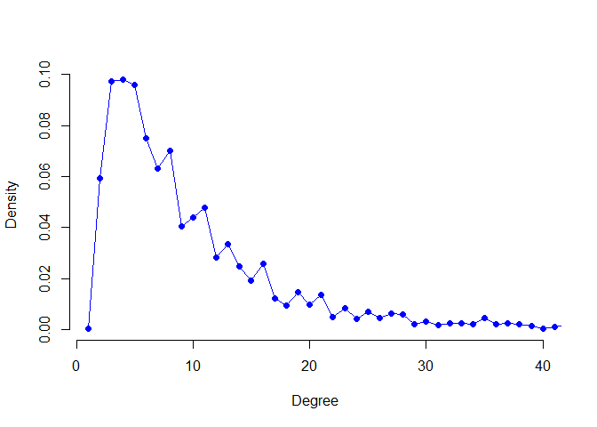
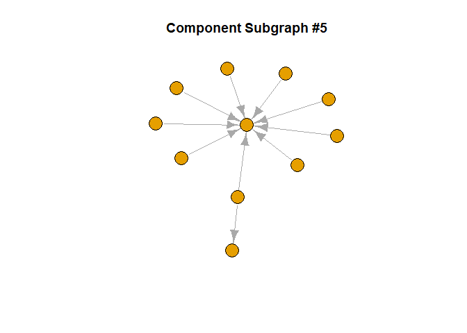
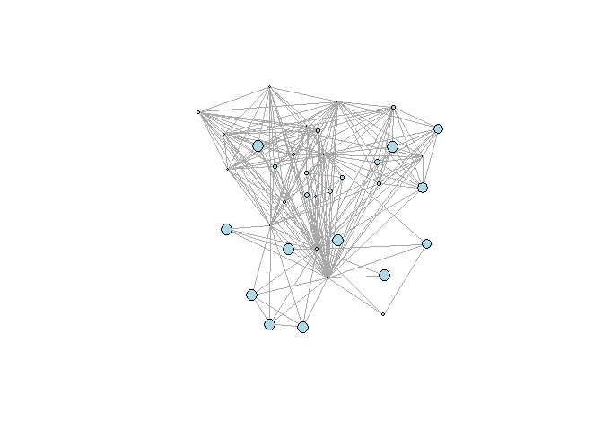

Lab 2: Measuring Networks - Centrality and Global Measures
================
Tiernan Cahill
15/06/2021

# Loading Data and Required Packages

Rather than having to re-convert the raw data from Brandwatch into a
graph object, we can serialize the existing graph objects from Lab 1 and
import them directly into our environment here.

We will also need to load a few packages for this lab:

-   `dplyr` for wrangling data
-   `igraph` for modelling and visualizing our network

``` r
library(dplyr)
library(igraph)

mention_graph <- readRDS("../data/mention_graph.RDS")
htag_graph <- readRDS("../data/htag_graph.RDS")
htag_uses_graph <- readRDS("../data/htag_uses_graph.RDS")
```

# Node-Level Centrality

The `igraph` package has various functions available for calculating
various common measures of node-level centrality.

## Degree

The most basic option for calculating centrality is by degree, or the
number of adjacent nodes. We will use the `degree` function to
demonstrate some of the different ways that centrality measures can be
handled in R.

``` r
# Use the degree function to calculate the degree centrality of each node
degree(mention_graph) %>% head()
```

    ##    ___Dustin__ __Ladderman421    __MrSwift__  __Princess__Q  __ruthlesss__          _ACHP 
    ##              1              1              1              2              1              2

``` r
# Can be applied to the entire network (as above) or to selected nodes
degree(htag_graph, v = c("#michigan", "#pennsylvania", "#wisconsin", 
                         "#minnesota", "#northcarolina", "#arizona"))
```

    ##      #michigan  #pennsylvania     #wisconsin     #minnesota #northcarolina       #arizona 
    ##             73             77             76             66             63             93

``` r
# By default, calculates the total degree, but accepts flags for in-degree
# and out-degree in directed networks
pol_users <- c("MissouriGOP", "OHDems",
                     "joebiden", "realdonaldtrump")
data.frame(deg.out = degree(mention_graph, v = pol_users, mode = "out"),
           deg.in = degree(mention_graph, v = pol_users, mode = "in"))
```

    ##                 deg.out deg.in
    ## MissouriGOP           8      0
    ## OHDems                8      0
    ## joebiden              0    549
    ## realdonaldtrump       0    721

``` r
# Append degree centrality as a node-level attribute to store within the graph object
V(mention_graph)$deg.out <- degree(mention_graph, mode = "out")
V(mention_graph)$deg.in <- degree(mention_graph, mode = "in")
V(htag_graph)$deg <- degree(htag_graph, mode = "total")

# Let's take a look!
vertex_attr_names(mention_graph)
```

    ## [1] "name"      "verified"  "followers" "region"    "deg.out"   "deg.in"

## Strength

*Weighted degree centrality*, also sometimes called *strength*, can be
calculated using the `strength` function. All of the uses of the
`degree` function shown above can also be applied here, and on
unweighted networks, `degree` is automatically called instead.

``` r
# Compare the weighted and unweighted degree centrality for a weighted network
V(htag_graph)$deg.weighted <- strength(htag_graph)

vertex.attributes(htag_graph) %>%
  as.data.frame() %>% head(10)
```

    ##                        name  deg deg.weighted
    ## 1             #election2020 3158        11883
    ## 2              #earlyvoting  112          415
    ## 3                     #vote  861         3162
    ## 4            #mmcthemonitor    4            4
    ## 5        #marymountmahattan    4            4
    ## 6                      #nyc   44           86
    ## 7                 #politics  231          542
    ## 8  #bidencrimefamilyexposed   19           24
    ## 9               #debate2020   94          234
    ## 10      #presidentialdebate   82          237

## Betweenness

Likewise, the `betweenness` function can be used to calculate the
*betweenness centrality* of each node. Recall that betweenness counts
the number of geodesics that pass through a given node. The
`betweenness` function take edge weights into consideration by default
(if the network is weighted), but this can be disabled by setting
`weights = FALSE`.

``` r
V(mention_graph)$betweenness <- betweenness(mention_graph, directed = TRUE)

# Let's take a look!
mention_centralities <- vertex.attributes(mention_graph) %>% 
  as.data.frame() %>% 
  select(name, deg.out, deg.in, betweenness)

mention_centralities %>% 
  arrange(desc(betweenness)) %>%
  head(20)
```

    ##              name deg.out deg.in betweenness
    ## 1    monica_sassy      20      2          15
    ## 2    jenniferclmn      14      1          13
    ## 3   didikins4life       3      3           4
    ## 4  lovebaldeagles       4      1           4
    ## 5  tamaraleighllc       2      2           4
    ## 6  crooksandliars       1      3           3
    ## 7         rparham       3      1           3
    ## 8  alex_henshaw16       1      2           2
    ## 9   bradpomerance       3      2           2
    ## 10        leggett       2      1           2
    ## 11   red_red_rita       2      1           2
    ## 12  reviewjournal       2      1           2
    ## 13  mirandadevine       1      1           1
    ## 14  thejoshuablog       3      2           1
    ## 15    ___Dustin__       1      0           0
    ## 16 __Ladderman421       1      0           0
    ## 17    __MrSwift__       1      0           0
    ## 18  __Princess__Q       2      0           0
    ## 19  __ruthlesss__       1      0           0
    ## 20          _ACHP       2      0           0

# Network-Level Measurements

The `igraph` package also offers a number of different functions for
calculating common network-level parameters that can help to specify the
shape and structure of a network.

## Size

The size of a network is simply defined as the number of edges it
contains. This can be calculated using the `gsize` function, but note
that the output will always be identical to that of the `ecount`
function.

``` r
gsize(htag_graph)
```

    ## [1] 21105

``` r
# For comparison
ecount(htag_graph)
```

    ## [1] 21105

## Density

The *density* of a network is considered to be the ratio of the number
of (actual) edges to the number of potential edges. This can be
calculated using the `edge_density` function. For the purposes of this
calculation, we need to decide whether or not to consider *loop edges*
that connect a given node to itself. The function defaults to ignore
loops if this is not specified and this is typically appropriate for
most networks.

``` r
edge_density(mention_graph, loops = F)
```

    ## [1] 0.0001384507

## Degree Distribution

In addition to calculating the degree centrality at the node level, we
may be interested in the distribution of degree centrality throughout
the network. For instance, are there a small number of highly-central
nodes, or is degree centrality more evenly distributed? The
`degree_distribution` function takes the same parameters as `degree` and
returns a vector showing the relative frequency of each degree in the
network. While this can be useful on its own, for networks with a wide
range of degree centralities, it may be more practical to visualize the
distribution.

``` r
degree_distribution(htag_graph) %>% glimpse()
```

    ##  num [1:3159] 0.000314 0.059415 0.097139 0.097768 0.095882 ...

``` r
# Visualize the distribution on a plot
degree_distribution(htag_graph) %>% plot(xlim = c(1, 40), 
                                         type = "o", pch = 19, col = "blue",
                                         xlab = "Degree", 
                                         ylab = "Density",
                                         frame = F)
```

<!-- --> We can see
from the visualization above that the vast majority of nodes in this
network have a low (&lt; 10) degree centrality, with a long tail of
various higher degrees also present.

## Diameter

The *diameter* of a network is defined as the length of the longest
geodesic (i.e., the shortest path betwen any two nodes). This can be
calculated for a graph object using the `diameter` function as shown
below. Note that in disconnected networks (i.e., those with more than
one component) this will return the diameter of the largest component by
default.

In formal graph theory, the weight of edges is incorporated in
calculating path length for weighted networks, such that a
higher-weighted path between two nodes is treated as “longer” than a
lower-weighted path. While this is sometimes appropriate, there are
instances in social network analysis where this interpretation of edge
weight is counter-intuitive. For example, consider the network of
Twitter mentions we have been working with thus far: under the normal
procedure for calculating geodesics, a path between two users who
frequently tweeted at each other would be considered longer than a path
between two users who had interacted only once. In this situation, it
may be justifiable to remove the edge weights from the graph object for
the purpose of calculating diameter, or the geodesic between two nodes.

``` r
# Calculate diameter
diameter(htag_graph, directed = F)
```

    ## [1] 36

``` r
# We may want to ignore edge weights when calculating diameter
mention_graph.unweighted <- mention_graph %>% 
  delete_edge_attr("weight")

diameter(mention_graph.unweighted, directed = T)
```

    ## [1] 2

``` r
# Determine the path of the longest geodesic (ignoring weight)
get_diameter(mention_graph.unweighted)
```

    ## + 3/7620 vertices, named, from dc9d435:
    ## [1] AndrewSenyk    alex_henshaw16 heather_giron

## Average Path Length

Similar to diameter, we may be interested in determining the average
length of the shortest paths between all pairs of nodes. This can be
simply calculated using the `mean_distance` function. (*Note:* This
function currently does not consider edge weights, and so it is not
necessary to remove them from a graph object when calculating average
path length).

``` r
mean_distance(mention_graph, directed = T) 
```

    ## [1] 1.007196

``` r
mean_distance(htag_graph, directed = F)
```

    ## [1] 2.007253

``` r
# Can also use related functions to figure out the shortest path between nodes
shortest_paths(mention_graph, 
               from = "dailycaller", to = "realdonaldtrump", 
               mode = "all", weights = NA)$vpath
```

    ## [[1]]
    ## + 3/7620 vertices, named, from dc9d435:
    ## [1] dailycaller     RL9631          realdonaldtrump

## Components

There may be situations in which we want to section a network into
*components*. Components are subgraphs of the network which are
connected within themselves, but disconnected from each other. In
fully-connected networks without isolates, there will be only one
component, and many networks have a “big component” structure, where
most of the nodes are connected to each other in one large component,
with a few smaller disconnected subgraphs adjacent.

Recall that in directed networks, components may be defined as either
*strong* or *weak*: A strong component is one in which all of the nodes
can be reached by following the directed edges (i.e., *arcs*); a weak
component is one in which all of the nodes are connected, but not
necessarily following the direction of the edges between them.

``` r
components(mention_graph, mode = "weak") -> mention_components
components(htag_graph) -> htag_components # Mode ignored for undirected graphs

# Let's take a look
str(mention_components)
```

    ## List of 3
    ##  $ membership: Named num [1:7620] 1 1 2 1 1 3 1 4 5 1 ...
    ##   ..- attr(*, "names")= chr [1:7620] "___Dustin__" "__Ladderman421" "__MrSwift__" "__Princess__Q" ...
    ##  $ csize     : num [1:1899] 3428 2 3 2 11 ...
    ##  $ no        : int 1899

``` r
# How many (weakly-connected) components does this network have?
count_components(mention_graph)
```

    ## [1] 1899

``` r
# How big is the largest component?
max(mention_components$csize)
```

    ## [1] 3428

``` r
# Which component is a given node in?
mention_components$membership["dailycaller"]
```

    ## dailycaller 
    ##           1

There are situations in which we may want to analyze one or more of the
component subgraphs of a network as a network in its own right. For
instance, we may be interested in determining geodesic paths only
between nodes that are actually capable of reaching each other, and
which are therefore within the same component (the `diameter` function
has actually already done this for us automatically) or we may be
interested in isolating a specific component for the purposes of
visualization.

``` r
# Decompose a single graph object into separate objects for each component
decompose(mention_graph, mode = "weak") -> mention_graphs

# Let's take a look!
V(mention_graphs[[1]]) %>% head()
```

    ## + 6/3428 vertices, named, from 9023232:
    ## [1] ___Dustin__    __Ladderman421 __Princess__Q  __ruthlesss__  _asyan         _Burky

``` r
V(mention_graphs[[2]]) %>% head()
```

    ## + 2/2 vertices, named, from 9023232:
    ## [1] __MrSwift__   hdrewgalloway

``` r
V(mention_graphs[[3]]) %>% head()
```

    ## + 3/3 vertices, named, from 902336b:
    ## [1] _ACHP        ceciconnolly zekeemanuel

``` r
# Visualize a component subgraph
mention_graphs[[5]] %>% plot(vertex.label = NA,
                             main = "Component Subgraph #5")
```

<!-- -->

## Clustering Coefficient

The *clustering coefficient* of a node is defined as the probabilty that
the adjacent nodes are connected with each other. `igraph` refers to
this property as *transitivity* and offers the `transitivity` function
with options that allow us to calculate the clustering coefficient
either on a per-node basis or for the network as a whole. (*Note:* This
function ignores the direction of edges in directed networks.)

``` r
transitivity(htag_graph, type = "global")
```

    ## [1] 0.04096042

``` r
# Calculate node-level clustering coefficients
V(htag_graph)$clustering <- transitivity(htag_graph, type = "local", isolates = "zero")

# Let's take a look!
vertex_attr(htag_graph, "clustering", "#usps")
```

    ## [1] 0.302521

``` r
# Apply clustering coefficient in a visualization
# ===============================================

usps_ego_graph <- make_ego_graph(htag_graph, nodes = "#usps")[[1]]

# Scale nodes to clustering coefficient
V(usps_ego_graph)$size <- vertex_attr(usps_ego_graph, "clustering")*10

plot(usps_ego_graph, 
     layout = layout_with_dh,
     vertex.label = NA,
     vertex.color = "lightblue")
```

<!-- -->
