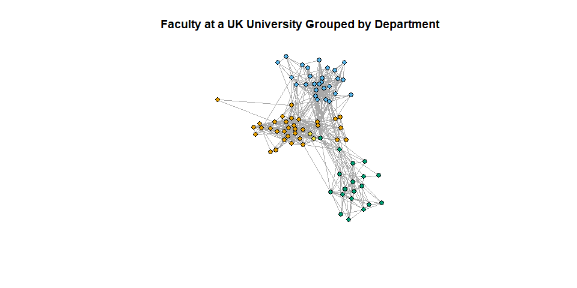
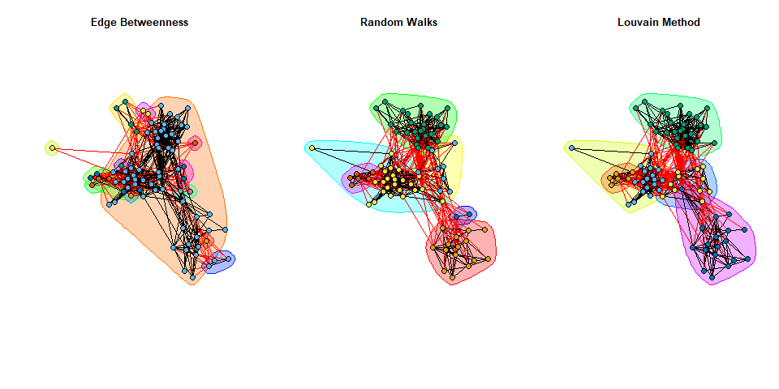
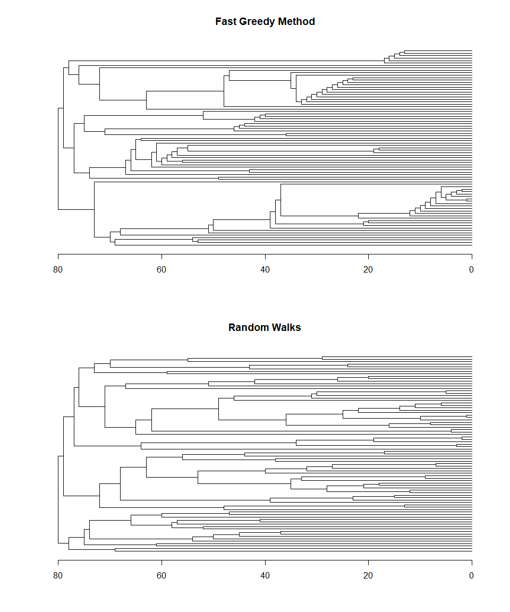
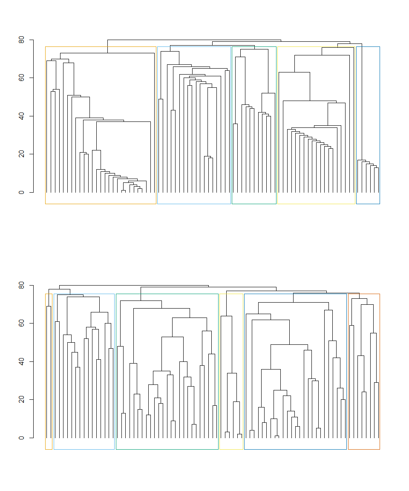

Lab 3: Measuring Networks - Community Structure and Assortment
================
Tiernan Cahill
21/06/2021

# Loading Data and Required Packages

We will again be importing the graph objects to be used in this analysis
from the serialized RDS format.

We will also need to load a few packages for this lab:

-   `dplyr` for wrangling data
-   `igraph` for modelling and visualizing our network
-   `igraphdata` for sample network data
-   `netseg` for alternative homophily and segregation measures

(*Note*: Community detection algorithms can be quite slow for larger
networks, so for the purposes of quickly demonstrating multiple
approaches, we will use a smaller network provided in the `igraphdata`
package, which models friendships among faculty members at a university
(Nepusz et al., 2008).)

``` r
library(dplyr)
library(igraph)
library(netseg)

# Add faculty sample data to R environment (must have igraphdata installed)
data("UKfaculty", package = "igraphdata")

htag_graph <- readRDS("../data/htag_graph.RDS")
mention_graph <- readRDS("../data/mention_graph.RDS")
```

# Community Detection

There are a variety of different algorithms available as part of the
`igraph` package for detecting the underlying community structure of
networks. Most aim to maximise *modularity*, which is defined as the
observed proportion of edges occurring within communities compared to
what would be expected from a random graph.

It should be noted that there is no one-size-fits-all approach to
community detection. Not all algorithms will identify the optimal
configuration, and modularity is known to be an imperfect measure of
community structure (e.g., often biased against small communities in
networks where large communities are present). All of these approaches
also suffer from the limitation that the assigned community memberships
are *exhaustive* and *exclusive* — every node belongs to a community,
and to **only** one community.

``` r
# Newman and Girvan's (2004) modularity optimization algorithmm based on edge
# betweenness
cluster_edge_betweenness(UKfaculty, directed = T) -> comms.betweenness

# Pons and Latapy's (2005) modularity optimization algorithm based on random 
# walk distances
cluster_walktrap(UKfaculty) -> comms.randomwalk

# Clauset et al.'s (2004) hierarchical agglomerative method designed to improve
# performance on large, sparesly populated graphs (only works for undirected
# networks)
cluster_fast_greedy(as.undirected(UKfaculty)) -> comms.fastgreedy

# Blondel et al.'s (2008) multi-level modularity optimization algorithm (also 
# only works for undirected networks)
cluster_louvain(as.undirected(UKfaculty)) -> comms.louvain
```

All of the community detection algorithms included in `igraph` will
output a `communities` object with a similar structure (some elements
may depend on the particular algorithm used to generate the object).
This object can be used and interpreted in a number of different ways,
as shown below.

``` r
# Let's take a look at the output from one of the community detection algorithms
print(comms.louvain)
```

    ## IGRAPH clustering multi level, groups: 5, mod: 0.56
    ## + groups:
    ##   $`1`
    ##   [1] 14 20 26 51 56 80
    ##   
    ##   $`2`
    ##    [1]  2  8 11 15 18 19 21 25 29 31 34 35 39 41 43 46 57 58 79
    ##   
    ##   $`3`
    ##    [1]  5  6  7 10 12 13 16 22 23 27 28 30 33 40 42 47 49 63 65 66 67 68 69 71 72 76 77
    ##   
    ##   $`4`
    ##   + ... omitted several groups/vertices

``` r
# How many communities are there?
length(comms.louvain)
```

    ## [1] 5

``` r
# Compare this to the output from a different algorithm
length(comms.betweenness)
```

    ## [1] 14

``` r
# How big is each community?
sizes(comms.louvain)
```

    ## Community sizes
    ##  1  2  3  4  5 
    ##  6 19 27 11 18

``` r
# Which community does each node belong to?
cbind(node = V(UKfaculty), 
      community = membership(comms.betweenness)) %>% 
  head(10)
```

    ##       node community
    ##  [1,]    1         1
    ##  [2,]    2         2
    ##  [3,]    3         2
    ##  [4,]    4         2
    ##  [5,]    5         2
    ##  [6,]    6         3
    ##  [7,]    7         2
    ##  [8,]    8         2
    ##  [9,]    9         2
    ## [10,]   10         2

``` r
# Try using the output of a different algorithm
cbind(node = V(UKfaculty), 
      community = membership(comms.randomwalk)) %>% 
  head(10)
```

    ##       node community
    ##  [1,]    1         1
    ##  [2,]    2         4
    ##  [3,]    3         1
    ##  [4,]    4         1
    ##  [5,]    5         2
    ##  [6,]    6         3
    ##  [7,]    7         3
    ##  [8,]    8         4
    ##  [9,]    9         5
    ## [10,]   10         3

``` r
# Which nodes are in each community?
communities(comms.randomwalk)
```

    ## $`1`
    ##  [1]  1  3  4 17 36 44 45 53 59 61 73 74 75 78 81
    ## 
    ## $`2`
    ## [1]  5 24 32 48 52 55 64 67
    ## 
    ## $`3`
    ##  [1]  6  7 10 12 13 16 22 23 27 28 30 33 40 42 47 49 63 65 66 68 69 71 72 76 77
    ## 
    ## $`4`
    ##  [1]  2  8 11 15 18 19 21 25 29 31 34 35 37 38 39 41 43 46 50 54 57 58 62 70 79
    ## 
    ## $`5`
    ## [1]  9 60
    ## 
    ## $`6`
    ## [1] 14 20 26 51 56 80

``` r
# What about a specific community
communities(comms.randomwalk)[[2]]
```

    ## [1]  5 24 32 48 52 55 64 67

## Visualizing Community Detection

Once a community structure for a given network has been identified using
a community detection algorithm, it can also be incorporated into
visualizations of that network. For smaller networks, this can also be a
useful way to compare the output of different algorithms to see which
have face validity, or align with other attributes of the network.

``` r
# Set an RNG seed so that we get consistent layouts
set.seed(9)
l = layout_with_fr(UKfaculty)

# Plot the whole network, colour-coded by the faculty members' departments
plot(UKfaculty,
     layout = l,
     edge.arrow.mode = 0,
     vertex.label = NA,
     vertex.size = 6,
     vertex.color = V(UKfaculty)$Group,
     main = "Faculty at a UK University Grouped by Department")
```

<!-- -->

``` r
# Add the results of some community detection algorithms to the visualization
par(mfrow=c(1, 3))

plot(comms.betweenness, UKfaculty,
     layout = l,
     edge.arrow.mode = 0,
     vertex.label = NA,
     vertex.size = 6,
     main = "Edge Betweenness")

plot(comms.randomwalk, UKfaculty,
     layout = l,
     edge.arrow.mode = 0,
     vertex.label = NA,
     vertex.size = 6,
     main = "Random Walks")

plot(comms.louvain, UKfaculty,
     layout = l,
     edge.arrow.mode = 0,
     vertex.label = NA,
     vertex.size = 6,
     main = "Louvain Method")
```

<!-- --> We can also
visualize the aggregation/division strategy used by the algorithm by
plotting its output as either a *dendrogram* or a *hierarchical
cluster*.

``` r
par(mfrow = c(2, 1))

# Plot as dendrograms
dendPlot(comms.fastgreedy, mode = "dendrogram", leaflab = "none", horiz = T,
       main = "Fast Greedy Method")

dendPlot(comms.randomwalk, mode = "dendrogram", leaflab = "none", horiz = T,
       main = "Random Walks")
```

<!-- -->

``` r
# Plot as hierarchical clusters
dendPlot(comms.fastgreedy, mode = "hclust", labels = F,
       main = "Fast Greedy Method")

dendPlot(comms.randomwalk, mode = "hclust", labels = F,
       main = "Random Walks")
```

<!-- -->

# Measures of Community

The modular structure of a network can be quantified and calculated in
different ways, measuring the extent to which a network is clustered
into discrete groups (i.e., *communities*), as well as the extent to
which node-level attributes are related to the structure of these
groups.

## Modularity

As mentioned above, *modularity* is a measure of the tendency of the
nodes in a network to form discrete groups, defined as the proportion of
edges occurring within a given community structure compared to a random
graph:

$$Q = \\frac{1}{2m} \\left(A\_{ij}-\\frac{k\_i k\_j}{2m}\\right)\\delta\\left(c\_i,c\_j\\right)$$

Since modularity is calculated based on a pre-defined community
structure, we can compare how this value varies depending on which
community detection algorithm we use (and this can be a valuable metric
when comparing the effectiveness of different algorithms). We can also
define a community structure based on nominal node-level attributes,
which can be especially useful when these attributes reflect real-world
organizational units.

``` r
# Calculate the modularity of a given community configuration
modularity(comms.betweenness)
```

    ## [1] 0.1207761

``` r
# Now compare the modularity of different algorithmic approaches to 
# community configuration
cbind("modularity" = c(
        "edge betweenness" = modularity(comms.betweenness),
        "fast greedy method" = modularity(comms.fastgreedy),
        "louvain method" = modularity(comms.louvain),
        "random walks" = modularity(comms.randomwalk)))
```

    ##                    modularity
    ## edge betweenness    0.1207761
    ## fast greedy method  0.5622017
    ## louvain method      0.5622017
    ## random walks        0.5578907

``` r
# Modularity can also be calculated for arbitrary configurations (such as
# faculty department)
modularity(UKfaculty, membership = V(UKfaculty)$Group)
```

    ## [1] 0.4450598

``` r
# Let's try calculating modularity based on social media data!
mention_comms <- mention_graph %>% 
  as.undirected() %>%
  cluster_fast_greedy()

htag_comms <- htag_graph %>%
  as.undirected() %>%
  cluster_fast_greedy()

cbind("modularity" = c(
  "user mentions" = modularity(mention_comms),
  "hashtag coincidence" = modularity(htag_comms)))
```

    ##                     modularity
    ## user mentions        0.8206406
    ## hashtag coincidence  0.3847652

## Assortment

In contrast to modularity, *assortment* represents the tendency for
nodes that have some defined attribute in common to be connected to each
other. The assortment (or *assortativity*) coefficient is a modified
form of the Pearson correlation intended to measure this tendency within
a network:

$$r = \\frac{\\sum\_{ij} \\left(A\_{ij}-k\_ik\_j/2m\\right)x\_ix\_j}{\\sum\_{ij} \\left(k\_i\\delta\_{ij}-k\_ik\_j/2m\\right)x\_ix\_j}$$

``` r
# Calculate the assortment coefficient based on a nominal node-level attribute
assortativity_nominal(UKfaculty, V(UKfaculty)$Group, directed = T)
```

    ## [1] 0.7053802

``` r
# Calculate the assortment coefficient based on degree centrality
assortativity_degree(UKfaculty, directed = T)
```

    ## [1] 0.03805201

``` r
# By degree
assortativity_degree(mention_graph, directed = T)
```

    ## [1] -0.05020587

``` r
# The assortativity function doesn't like missing data, so we will have to replace
# this with a flag (noting that this *will* affect the results)
mention_graph.nomissing <- mention_graph
V(mention_graph.nomissing)$region[is.na(V(mention_graph.nomissing)$region)] <- 99L
V(mention_graph.nomissing)$followers[is.na(V(mention_graph.nomissing)$followers)] <- 0
V(mention_graph.nomissing)$verified[is.na(V(mention_graph.nomissing)$verified)] <- F

# By region
assortativity_nominal(mention_graph.nomissing, as.factor(V(mention_graph.nomissing)$region), directed = T)
```

    ## [1] 0.004242818

``` r
# By followers
assortativity(mention_graph.nomissing, V(mention_graph.nomissing)$followers, directed = T)
```

    ## [1] -0.002980908

### Alternative Homophily Measures

Assortment is one measure of *homophily*, or the general tendency of
nodes in social networks to form connection with nodes with shared
traits (i.e., “birds of a feather flock together”). While this is the
primary measure of homophily included in the `igraph` package,
additional measures of homophily (including some that provide group- or
node-level calculations, such as Coleman’s index) are available through
the `netseg` package.

The most commonly-used of these is likely the *E/I Index*, which is
defined as the ratio of between-group (*E*) to within-group ties(*I*):

$$EI = \\frac{E-I}{E+I}$$

Note that this means that a negative *E-I* index represents a tendency
towards homophily (more within-group ties) and a postive index
represents a tendency towards heterophily (more between-group ties).

``` r
# The netseg package provides a number of additional measures of homophily and
# segregation
ei(UKfaculty, "Group")                      # Krackhard and Stern's E/I Index
```

    ## [1] -0.627907

``` r
freeman(as.undirected(UKfaculty), "Group")  # Freeman's segregation index
```

    ## [1] 0.6896092

``` r
coleman(UKfaculty, "Group")                 # Coleman's homophily index
```

    ##          1          2          3          4 
    ## 0.70562771 0.83188863 0.64809384 0.09985935

``` r
# Let's try this on some real-world social media data!
ei(mention_graph, "verified")
```

    ## [1] -0.873756

``` r
freeman(as.undirected(mention_graph), "region")
```

    ## [1] 0.02147682

``` r
coleman(mention_graph, "verified")
```

    ##      FALSE       TRUE 
    ##  0.3679071 -0.4760275

``` r
# Note that the functions from the netseg package can handle missing data, even
# for calculating the assortment coefficient
assort(mention_graph, "region")
```

    ## [1] 0.005749706
