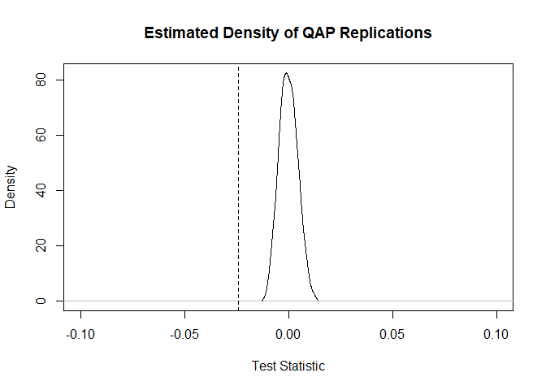

Intro to Network Regression
================
Tiernan Cahill
23/06/2021

# Loading Data and Required Packages

We will again be importing the graph objects to be used in this analysis
from the serialized RDS format.

We will also need to load a few packages for this lab:

-   `readxl` for importing Excel data
-   `igraph` for modelling and visualizing our network
-   `statnet` for additional inferential analysis tools

## Helper Functions

We will also be importing a file containing *helper functions*: Since
the procedures demonstrated in this lab are primarily intended to infer
relationships between different networks, we will need graphs to serve
as both the dependent and independent variables in these relationships.
For this analysis, we will treat the network of Twitter mentions used in
previous labs as the DV and use the helper functions to generate
additional networks from the same dataset, which can function as IVs.
The file contains functions for generating sociomatrices based on shared
attributes in Brandwatch data, as well as aliases to simplify applying
these functions to some likely attributes (e.g., hashtag usage,
interests, gender, region).

The functions are provided in a separate file (`lab4_functions.R`) so
that they can be easily reused in other analyses, but you may wish to
look over the code yourself for future reference in how to construct
different graphs from the same dataset.

``` r
library(readxl)
library(igraph)
library(statnet)

# Import helper functions
source("lab4_functions.R")
```

## Dataset

The methods demonstrated in this lab can be very computationally
demanding and time-consuming, especially for large networks. This is
partly due to the design of the algorithms provided as part of the
`statnet` package, which are based on networks in an *adjacency matrix*
format, but is also due to the fact that the Quadratic Assignment
Procedure (QAP) on which these approaches are based requires a
significant number of replications. For this reason, we will be
importing a significantly smaller dataset, based on the keyword matching
demonstrated in Lab 1 (tweets containing terms related to the COVID-19
pandemic).

``` r
# Import existing graph objects
mention_graph <- readRDS("../data/covid_tweets_mention_graph.RDS")

# Import original dataset
lab <- read_excel("../data/covid_tweets.xlsx") %>% 
  rename_all(~str_replace_all(., "\\s+", "")) # Remove whitespace from variable names
```

## Data Transformations

Using the provided helper functions, we will generate a selection of
sociomatrices representing shared attributes between nodes (*account
type*, *gender*, *hashtag usage*, *interests*, *region*, and *verified
status*). Note that in order to use the QAP algorithms provided in the
`statnet` package, all of the networks for both the DV and any IVs need
to be in a **non-sparse** adjacency matrix format. The helper functions
provide sparse matrices by default in order to conserve memory, and so
we will need to convert the ones we intend on using in the subsequent
analysis (using the `as.matrix` function).

``` r
# Use the helper functions to generate additional graphs based on shared
# attributes, to be used as IVs in our correlation / regression models

# acctype.mat <- matrix_gen_acctype(lab)
# gender.mat <- matrix_gen_gender(lab)
htag.mat <- matrix_gen_htag(lab)
interest.mat <- matrix_gen_interests(lab)
# region.mat <- matrix_gen_region(lab)
# verified.mat <- matrix_gen_verified(lab)

# Let's take a look at two of the generated matrices
htag.mat[1:10, 1:10]
```

    ## 10 x 10 sparse Matrix of class "dgCMatrix"

    ##    [[ suppressing 10 column names '', '__Princess__Q', '_ACHP' ... ]]

    ##                                   
    ##                . . . . . . . . . .
    ## __Princess__Q  . 3 1 1 1 1 1 1 1 1
    ## _ACHP          . 1 5 1 1 1 1 1 1 1
    ## _killa_kayyyy  . 1 1 3 2 1 1 1 2 1
    ## 2wheelninja500 . 1 1 2 2 1 1 1 2 1
    ## 3132888868     . 1 1 1 1 4 1 2 1 1
    ## 4ChangingTides . 1 1 1 1 1 5 1 1 1
    ## 4ThePeople7    . 1 1 1 1 2 1 7 1 1
    ## 5HERM4N5       . 1 1 2 2 1 1 1 3 1
    ## 62Antone       . 1 1 1 1 1 1 1 1 2

``` r
interest.mat[1:10, 1:10]
```

    ## 10 x 10 sparse Matrix of class "dgCMatrix"

    ##    [[ suppressing 10 column names '', '__Princess__Q', '_ACHP' ... ]]

    ##                                   
    ##                . . . . . . . . . .
    ## __Princess__Q  . 1 . . . 1 . . . .
    ## _ACHP          . . 1 . . . . . . .
    ## _killa_kayyyy  . . . 1 1 . 1 1 1 1
    ## 2wheelninja500 . . . 1 1 . 1 1 1 1
    ## 3132888868     . 1 . . . 3 . . . .
    ## 4ChangingTides . . . 1 1 . 1 1 1 1
    ## 4ThePeople7    . . . 1 1 . 1 1 1 1
    ## 5HERM4N5       . . . 1 1 . 1 1 1 1
    ## 62Antone       . . . 1 1 . 1 1 1 1

``` r
# In order to run a QAP tests, we need all the networks to be in a 
# regular (NOT sparse) adjacency matrix format

mention.mat <- as_adjacency_matrix(mention_graph, attr = "weight", sparse = F)
htag.mat <- as.matrix(htag.mat)
interest.mat <- as.matrix(interest.mat)
```

# Inferential Statistics with Networks

*QAP* allows researchers to conduct inferential analysis of network data
by providing robust standard errors based on *resampling*. In many ways,
this is similar to a bootstrap regression procedure.

## Correlation

The `gcor` function from the `statnet` package allows us to calculate a
*product-moment correlation coefficient*, equivalent to Pearson’s
correlation coefficient, between two graphs. However, the normal
procedures for calculating a *p*-value from Pearson’s correlation do not
apply neatly to network data. For this reason, we use a QAP test to
support null hypothesis statistical significance testing by comparing
the observed correlations against simulated graphs representing the null
hypothesis.

``` r
# Calculate the correlation coefficient between the mention network and shared
# hashtag usage - mode specifies whether or not graphs are directed
gcor(mention.mat, htag.mat, mode = "digraph")
```

    ## [1] -0.02395557

``` r
# Run a QAP test to determine if this level of correlation is significant
htag.cor <- qaptest(list(mention.mat, htag.mat),
                    gcor,
                    g1 = 1,
                    g2 = 2,
                    mode = "digraph",
                    reps = 1000)

# View results of QAP test
print(htag.cor)
```

    ## 
    ## QAP Test Results
    ## 
    ## Estimated p-values:
    ##  p(f(perm) >= f(d)): 1 
    ##  p(f(perm) <= f(d)): 0

``` r
# Plot results of QAP test
plot(htag.cor, xlim=c(-0.1, 0.1))
```

<!-- -->

## Linear Regression

For situations involving more than one IV, we may wish to construct a
*multiple regression model* for our network of interest (DV).
Calculation of standard errors for these models is also possible using
QAP and supported by the `netlm` function from `statnet`, which
functions similarly to the `lm` function from base R’s `stats` package,
albeit with a slightly different syntax, as shown below.

(*Note*: Running QAP for network regression models can take a
significant amount of time, especially on slower computers. For this
reason, you may wish to set a low number of repetitions for the `netlm`
function while testing your code, and then increase this number once you
are ready to analyze your data. If you do not specify a number of
repetions, the function will default to 1000.)

``` r
# Construct a linear multiple regression model using QAP
model.lm <- netlm(mention.mat,
                  list(htag.mat, interest.mat),
                  mode = "digraph",
                  reps = 1000)

# View the model summary
summary(model.lm)
```

    ## 
    ## OLS Network Model
    ## 
    ## Residuals:
    ##           0%          25%          50%          75%         100% 
    ## -0.002485542 -0.002485542 -0.002485542 -0.001039239  1.997514458 
    ## 
    ## Coefficients:
    ##             Estimate      Pr(<=b) Pr(>=b) Pr(>=|b|)
    ## (intercept)  0.0024855418 1.000   0.000   0.000    
    ## x1          -0.0014463024 0.000   1.000   0.000    
    ## x2          -0.0005585396 0.117   0.883   0.249    
    ## 
    ## Residual standard error: 0.04398 on 335817 degrees of freedom
    ## Multiple R-squared: 0.0005854    Adjusted R-squared: 0.0005794 
    ## F-statistic: 98.34 on 2 and 335817 degrees of freedom, p-value:     0 
    ## 
    ## 
    ## Test Diagnostics:
    ## 
    ##  Null Hypothesis: qap 
    ##  Replications: 1000 
    ##  Coefficient Distribution Summary:
    ## 
    ##        (intercept)       x1       x2
    ## Min       19.66484 -5.99433 -4.65825
    ## 1stQ      22.65663 -1.83449 -1.16627
    ## Median    23.55088 -0.14059 -0.03954
    ## Mean      23.63747 -0.08079  0.02070
    ## 3rdQ      24.70412  1.48756  1.07221
    ## Max       27.34304  9.18383  6.30770

## Logistic Regression

Just as with standard regression, a linear model is only appropriate if
the data used as the DV is *continuous* (i.e., interval- or
ratio-level). For networks in an adjacency matrix format, this typically
means that *weighted* networks should be fitted with a linear model,
wheras *unweighted* networks should be treated as nominal-level data,
and fit to a *logistic regression model*. Fortunately, this is supported
by the `netlogit` function.

For the purposes of this demonstration, we will collapse our weighted
network into an unweighted version to use in our logistic model.

``` r
# Get an unweighted (binary) matrix representation of the network
mention.mat_bin <- as_adjacency_matrix(mention_graph, attr = NULL, sparse = F)

# Construct a linear multiple regression model using QAP
model.log <- netlogit(mention.mat_bin,
                  list(htag.mat, interest.mat),
                  mode = "digraph",
                  reps = 1000)

# View the model summary
summary(model.log)
```

    ## 
    ## Network Logit Model
    ## 
    ## Coefficients:
    ##             Estimate   Exp(b)      Pr(<=b) Pr(>=b) Pr(>=|b|)
    ## (intercept) -5.9453664 0.002617943 0.997   0.003   0.997    
    ## x1          -4.1609433 0.015592842 0.000   1.000   0.007    
    ## x2          -0.1185632 0.888195669 0.464   0.536   0.945    
    ## 
    ## Goodness of Fit Statistics:
    ## 
    ## Null deviance: 465545.4 on 335820 degrees of freedom
    ## Residual deviance: 8611.284 on 335817 degrees of freedom
    ## Chi-Squared test of fit improvement:
    ##   456934.1 on 3 degrees of freedom, p-value 0 
    ## AIC: 8617.284    BIC: 8649.457 
    ## Pseudo-R^2 Measures:
    ##  (Dn-Dr)/(Dn-Dr+dfn): 0.5763882 
    ##  (Dn-Dr)/Dn: 0.9815028 
    ## Contingency Table (predicted (rows) x actual (cols)):
    ## 
    ##          0        1
    ## 0   335202      618
    ## 1        0        0
    ## 
    ##  Total Fraction Correct: 0.9981597 
    ##  Fraction Predicted 1s Correct: NaN 
    ##  Fraction Predicted 0s Correct: 0.9981597 
    ##  False Negative Rate: 1 
    ##  False Positive Rate: 0 
    ## 
    ## Test Diagnostics:
    ## 
    ##  Null Hypothesis: qap 
    ##  Replications: 1000 
    ##  Distribution Summary:
    ## 
    ##        (intercept)         x1         x2
    ## Min     -2.442e+10 -5.652e+00 -5.884e+00
    ## 1stQ    -2.536e+02 -1.671e+00 -1.044e+00
    ## Median  -2.517e+02 -9.316e-02  3.358e-02
    ## Mean    -1.979e+09  1.430e-03  9.109e-02
    ## 3rdQ    -2.502e+02  1.588e+00  1.169e+00
    ## Max      8.559e+01  8.420e+00  6.937e+00
